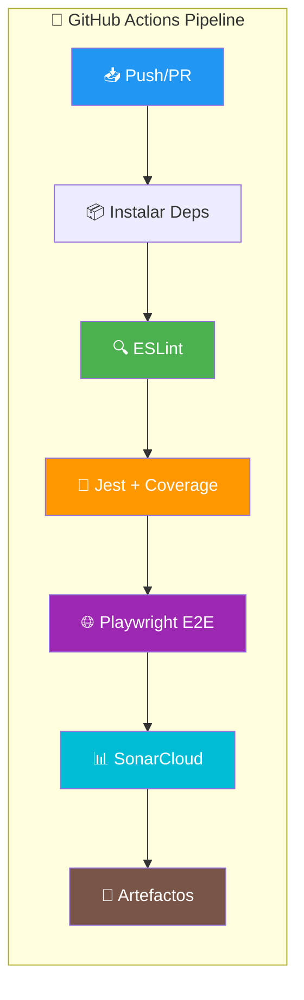
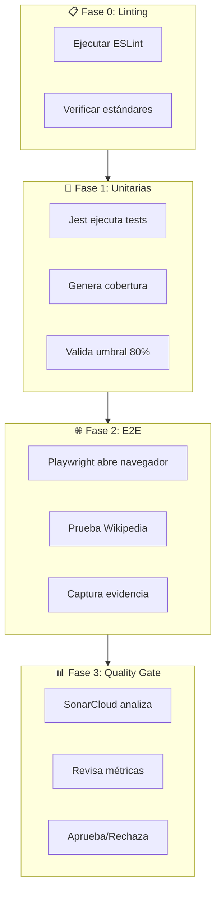

# Demo Calidad Total (Unitarias + E2E)

Este proyecto demuestra un pipeline completo de automatización de pruebas que combina:

## 🧪 **Pruebas Unitarias** (Jest)
- Pruebas rápidas de lógica de negocio
- Se ejecutan en milisegundos sin navegador
- Archivo: `logica.js` + `logica.test.js`

## 🌐 **Pruebas E2E** (Playwright)
- Pruebas de extremo a extremo en navegador real
- Automatización de Wikipedia
- Archivo: `tests/wikipedia.spec.js`

## 🔄 **CI/CD** (GitHub Actions)
- Pipeline automático en cada push
- Ejecuta ambas fases de pruebas
- Análisis de calidad con SonarCloud

## 📊 **Quality Gates** (SonarCloud)
- Análisis estático de código
- Métricas de cobertura
- Control de calidad automatizado

---

## � **Flujo del Pipeline**



### Detalle de cada fase:



---

## �🚀 **Ejecución Local**

### Instalar dependencias
```bash
npm install
```

### Ejecutar linting (verificar calidad de código)
```bash
npm run lint
```

### Ejecutar pruebas unitarias
```bash
npm run test:unit
```

### Ejecutar pruebas unitarias con cobertura
```bash
npm run test:coverage
```

### Ejecutar pruebas E2E
```bash
npm run test:e2e
```

### Ejecutar todas las pruebas
```bash
npm test
```

---

## 📋 **Estructura del Proyecto**

```
├── logica.js              # Funciones de lógica de negocio
│   ├── validarPassword()  # Valida contraseñas seguras
│   ├── validarEmail()     # Valida formato de email
│   ├── calcularDescuento()# Calcula precios con descuento
│   └── esMayorDeEdad()    # Verifica mayoría de edad
├── logica.test.js         # Pruebas unitarias (Jest)
├── tests/
│   └── wikipedia.spec.js  # Pruebas E2E (Playwright)
├── .github/workflows/
│   └── calidad.yml        # Pipeline CI/CD
├── .eslintrc.js           # Configuración ESLint
├── jest.config.js         # Configuración Jest + Cobertura
├── playwright.config.js   # Configuración Playwright
├── sonar-project.properties # Configuración SonarCloud
└── package.json           # Dependencias y scripts
```

---

## 🎯 **Para tu Presentación**

### Discurso Sugerido:

> **"Para cumplir con el ciclo completo de calidad, no usamos una sola herramienta."**
> 
> **"Primero, ESLint** verifica que el código siga estándares de calidad. Es como un revisor ortográfico."**
>
> **"Segundo, usamos Jest** (muestra `logica.test.js`) **para probar el código interno. Es como revisar que el motor del coche encienda."**
> 
> **"Tercero, usamos Playwright** (muestra `wikipedia.spec.js`) **para probar la experiencia del usuario. Es como sacar el coche a la autopista."**
> 
> **"Y GitHub Actions orquesta todo automáticamente, mientras SonarCloud valida la calidad."**

### Puntos Clave para Destacar:

| Aspecto | Detalle |
|---------|---------|
| ⚡ **Velocidad** | Las unitarias corren en ms, las E2E en segundos |
| 📊 **Cobertura** | 80% mínimo garantizado por Jest |
| 🔍 **Linting** | ESLint asegura código limpio |
| 🤖 **Automatización** | Todo se ejecuta sin intervención manual |
| ✅ **Quality Gate** | SonarCloud asegura estándares mínimos |

---

## 🔧 **Configuración Adicional**

Para que SonarCloud funcione, necesitas:

1. Crear cuenta en [SonarCloud](https://sonarcloud.io/)
2. Conectar tu repositorio GitHub
3. Configurar los secrets en GitHub:
   - `SONAR_TOKEN`: Token de SonarCloud
   - `GITHUB_TOKEN`: Token de GitHub (automático)

---

## 📈 **Métricas Esperadas**

- **Pruebas Unitarias**: 100% cobertura en `logica.js`
- **Pruebas E2E**: 3 escenarios funcionales en Wikipedia
- **Pipeline**: Ejecución completa en < 3 minutos
- **Quality Gate**: Aprobado si todas las pruebas pasan
- **Linting**: 0 errores de ESLint

